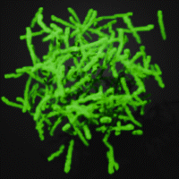

Implementing [the slime mold outlined here](https://bleuje.com/physarum-explanation/)

- eventually in arbitrarily large dimensions
- n-dimensional slime
- higher dimensional mold
- all this to come
- vdb interop

Presently this is not performant at all. Probably not biologically accurate. Mostly just a rough sketch.
